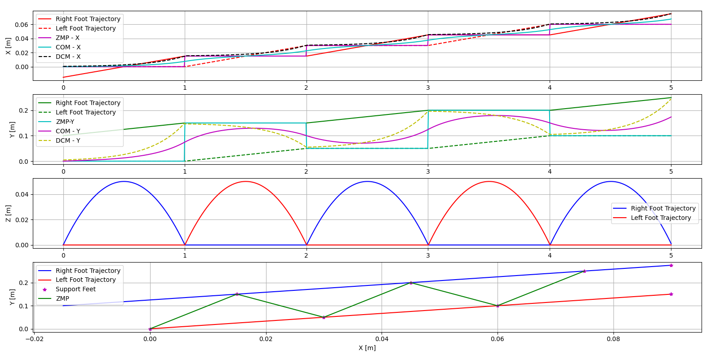

# Bipedal Robot Walking Engine in PyBullet

This project implements a real-time bipedal walking engine for a humanoid robot simulated in [PyBullet](https://github.com/bulletphysics/bullet3). The system includes trajectory generation, inverse kinematics, basic balance control, and interactive keyboard-based teleoperation.


<div align="center">
  
</div>

<div align="center">
  
</div>

## Features

- Realistic walking pattern generation using step parameters
- Interactive keyboard control for step size, direction, and timing
- Balance control using foot-ground contact (CoP)
- Support for external force disturbances
- Upper-body motion generation (arms and torso)
- Integration of model-based control strategies for enhanced stability

## Directory Structure

```
├── main.py                       # Entry script for walking simulation
├── test_modules.py               # Testing the walking trajectory generators 
├── walkEngine/
│   ├── GenrateWalkingTrajectories.py  # Trajectory generation module
│   └── RobotControl.py                # Kinematics, control, balance
├── Keyboard/
│   └── keyboardMonitoring.py         # Threaded keyboard input handler
```


## Keyboard Controls

The system supports real-time keyboard input using the following keys:

- Arrow Up/Down: Increase/decrease step length (`step_x`)
- Arrow Left/Right: Turn left/right (`step_theta`)
- A/D: Adjust lateral step (`step_y`)
- T/Y: Increase/decrease step time
- Space: Toggle walking on/off
- F: Apply forward push
- G: Apply sideward push
- S: Toggle logging to CSV file
- R: Reset model pose
- Z: Exit the simulation

The keyboard input is handled in a separate thread using the **Keyboard.py**


## Requirements

- Python 3.7+
- `pybullet`
- `numpy`
- `scipy`

Install dependencies using pip:

```bash
pip install pybullet numpy scipy
```

## Usage

Run the simulation with:

```bash
python main.py
```

Once the simulation starts:
- Use keyboard commands to change walking direction and speed.
- Press a key (as defined in `keyboardMonitoring.py`) to apply a push (external force).
- The robot will continue walking until you press the designated exit key.

> Make sure your terminal window is in focus to send keyboard input.

## Parameters

Key walking parameters you can modify in `main.py`:
- `step_x`, `step_y`, `step_theta`: step size in x, y, and rotation
- `step_time`: duration of one step
- `z_leg`: vertical position of the hip
- `distance_between_feet`: base stance width


## Contributing

Pull requests are welcome! If you find bugs or want to improve the walking engine, feel free to fork and submit a PR.

## License

This project is licensed under the MIT License.

---


## Citation
If you find our work useful in your research, please consider citing:
```
@article{kasaei2021robust,
  title={Robust biped locomotion using deep reinforcement learning on top of an analytical control approach},
  author={Kasaei, Mohammadreza and Abreu, Miguel and Lau, Nuno and Pereira, Artur and Reis, Luis Paulo},
  journal={Robotics and Autonomous Systems},
  volume={146},
  pages={103900},
  year={2021},
  publisher={Elsevier}
}

@inproceedings{kasaei2019robust,
  title={A robust biped locomotion based on linear-quadratic-Gaussian controller and divergent component of motion},
  author={Kasaei, Mohammadreza and Lau, Nuno and Pereira, Artur},
  booktitle={2019 IEEE/RSJ International Conference on Intelligent Robots and Systems (IROS)},
  pages={1429--1434},
  year={2019},
  organization={IEEE}
}

```
